# codewhisperer-hands-on
VSCでCodeWhispererを使って見たメモ

## AWS Builder IDの準備
### AWS Builder IDとは
`AWS Builder ID`は、AWSで開発をする人のための新しい個人プロファイルです。特徴は以下の通りです。[^1]
- `AWS Builder ID`は無料
- `AWS Builder ID`で利用できるサービスは以下(2023.5現在)
    - [Amazon CodeCatalyst(Preview)](https://docs.aws.amazon.com/codecatalyst/latest/userguide/welcome.html) ※Webベースの統合IDE
    - [Amazon CodeWhisperer](https://docs.aws.amazon.com/toolkit-for-jetbrains/latest/userguide/codewhisperer.html) ※コード自動生成
    - [AWS re:ポスト](https://repost.aws/)
- AWSアカウントとは独立した別のアカウント(そのためAWSアカウントと同じメールアドレスの利用も可能)
- IDの作成にはメールアドレスを利用する
- 認証に多要素認証(MFA)利用可能。
- AWS Builder IDは、米国東部(us-east-1)リージョンで利用可能。

### AWS Builder IDの作成
1. [AWS ビルダー ID の作成](https://us-east-1.signin.aws/platform/login?workflowStateHandle=9a446da5-b938-4056-a5b7-69857192805c)に移動
1. メールアドレスを入力して、次に進む
1. 名前(システム内で表示される名前)を設定して、次に進む
1. メールアドレス検証(入力したメールアドレスに届いた番号を入れて検証)
1. ログインパスワードを設定し、次に進む
1. ID作成完了

[^1]:[AWS Sign-In User Guide - Sign in with AWS Builder ID](https://docs.aws.amazon.com/ja_jp/signin/latest/userguide/sign-in-aws_builder_id.html)

## AWS Toolkit for Visual Studio Codeセットアップ
`AWS Toolkit for Visual Studio Code`は、Visual Studio Code (VS Code) エディタのオープンソースの拡張機能です。
- [AWS Tookkit for VSCodeユーザーガイド](https://docs.aws.amazon.com/ja_jp/toolkit-for-vscode/latest/userguide/welcome.html)
- [GitHub repository](https://github.com/aws/aws-toolkit-vscode)
### AWS toolkit for VSCodeのインストール
- 前提条件は以下の通りです。
    - OS: Windows, MacOS, Linux(VS Codeの前提)
    - VS Codeバージョン: 1.42.0以降
- [VS Code Marketplace](https://marketplace.visualstudio.com/items?itemName=AmazonWebServices.aws-toolkit-vscode) にアクセスしてinstallをクリックし指示に従います。

## CodeWhispererの利用(AWS Builder ID認証の場合)
### AWS Builder IDの認証&連携しCodeWhispererを開始する
- AWS Toolkit for VS Codeを開く
    - 左のバーからawsのマークをクリックします。
    - awsのマークがない場合は、拡張機能で`AWS Toolkit`で検索し有効化します。
    - 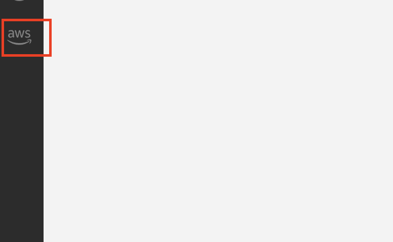
- `DEVELOPER TOOLS` -> `CodeWhisperer` -> `Start` をクリックします。
    - 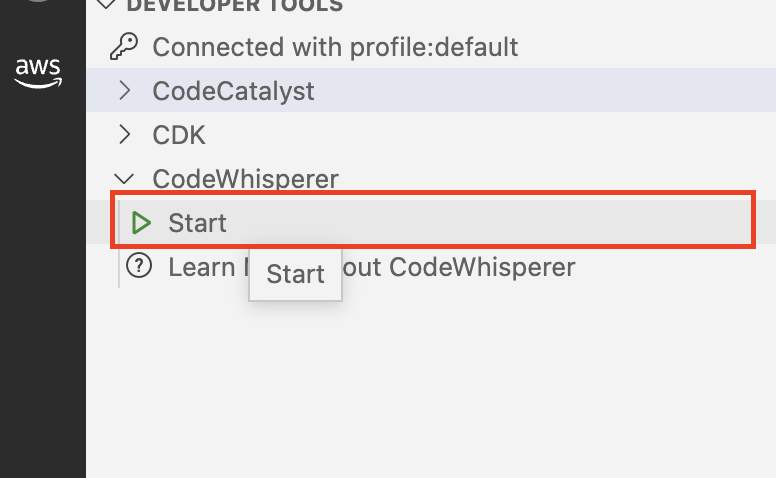
- 認証方法の選択
    - AWS Toolkitでの認証方法は、(1)`AWS Builder ID`、(2)`IAM Identity Center(AWS SSO)、(3)`IAM認証`の3つがありますが、CodeWhispererでは(3)は選択不可能です。
    - `AWS Builder ID`を選択します。
    - 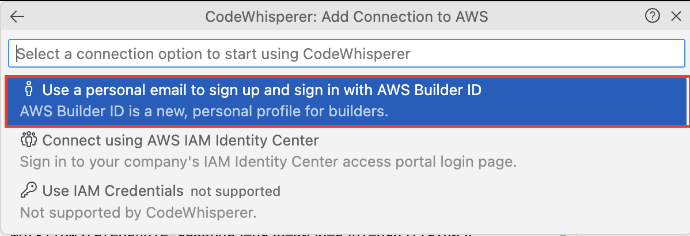
- AWS Builder IDへの連携
    - (1) (参考として)連携で必要となるコードです。
    - (2) `Copy Code and Proceed`をクリックします。
    - 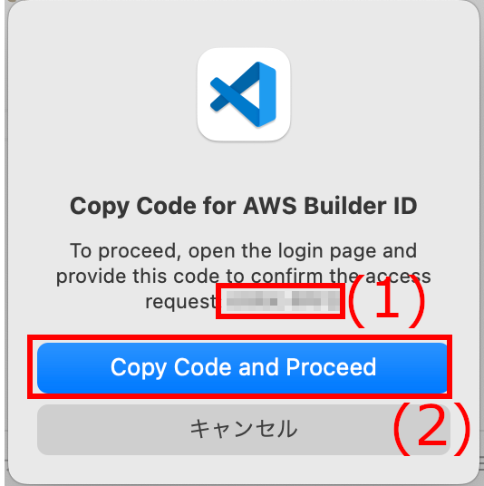
- (ブラウザ)AWS Builder ID認証(1)
    - VS Codeからブラウザが開きます。
    - `command + C`でcodeを貼り付けて、nextをクリックします。
    - 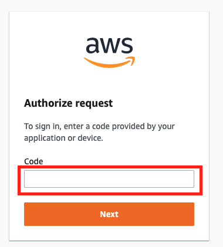
- (ブラウザ)AWS Builder ID認証(2)
    - ブラウザで、AWS Builder IDが認証済みの場合はスキップされます。
    - 既存のAWS Builder IDを利用する場合は`すでにAWS Builder IDをお持ちですか？サインイン`へ進んで認証します。
    - 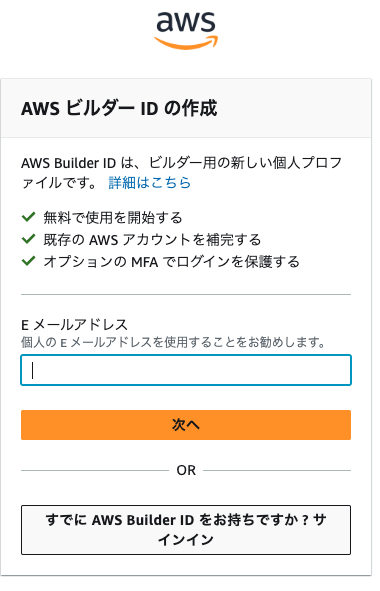
- (ブラウザ)CodeWhispererとの連携
    - 内容を確認して`Allow`をクリックします。
    - 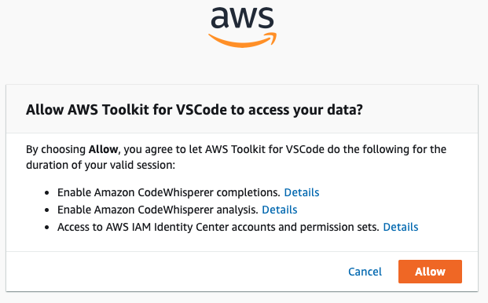


- AWS Toolkit認証
    - AWS Builder IDの認証をCodeWhispererのみで利用するか、全ての機能の認証をAWS Builder IDに置き換えるかの選択です。
    - 通常置き換えはしない方が良いので、`Yes, keep using AWS Builder ID with・・・`を選択します。
    - 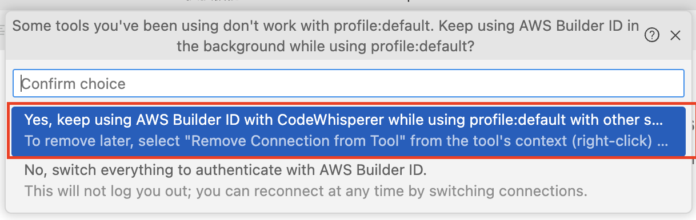


### CodeWhispererを使ってみる。
- 例えば、`test.py`というからのファイルを作成
- 先頭に以下を入力して改行して、しばらく待つ。
- すると`import boto3`がサジェスチョンされる。
- `TAB`キーでCodeWhispereのサジェスチョンが選択できる。
    ```python
    #!env python3
    ```
- その後、コメントで下記を入力
    ```python
    #create a s3 bucket.
    ```
    
### CodeWhispereの切断
- 認証を切断する場合は、下記のいずれかの方法で行う。
    - 切断ボタンをクリックする
        - 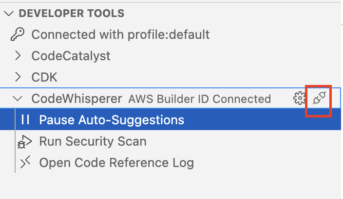
    - 右クリック(macは指２本でクリック)して`Remove Connection from Tool`を選択
        - 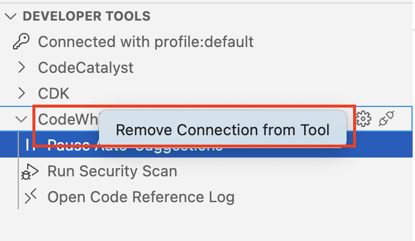

- AWS Builder IDのサインアウト
    - `DEVELOPER TOOLS` -> `Connected with・・・`を確認し、AWS Builder IDでない場合は、右クリックして`Switch Connections`で`AWS Builder IDを選択する`
    - `Connected with・・・`の右クリックで、`Sign out`を選びサインアウトする。
        - 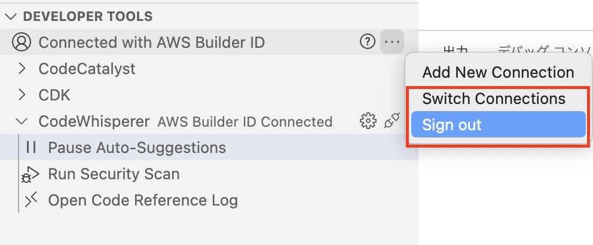

## CodeWhispererの利用(AWS Cloud9の場合)
### AWS Cloud9のユーザ用ロール作成
Clud9ユーザを模擬したロールを作成
- Role名: `任意`
- 信頼先: `スイッチロール元のAWSアカウント`
- 付与するポリシー
    - マネージドポリシー
        - AWSCloud9User
        - ReadOnlyAccess
    - インラインポリシー
    ```json
    {
        "Version": "2012-10-17",
        "Statement": [
            {
                "Sid": "CodeWhispererPermissions",
                "Effect": "Allow",
                "Action": ["codewhisperer:GenerateRecommendations"],
                "Resource": "*"
            }
        ]
    }
    ```
### AWS Cloud9インスタンス作成とIDE環境へログイン
- Cloud9インスタンス作成してIDE環境に入る
### 操作
- CodeWhispereの開始
    - 左のメニューからAWS tookkit(AWSアイコン)を開く
    - `DEVELOPER TOOLS`-> `CodeWhispere`をクリックして開く
    - Startボタンを押してClodeWhispereを開始する。
    - 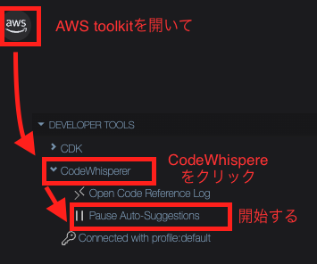


## CodeWhispererを深掘り
### エンドポイント
- AWSドキュメント -> `非公開`の模様
    -[Service endpoints and quotas](https://docs.aws.amazon.com/general/latest/gr/aws-service-information.html)にAmazon CodeWhispererの記載なし
    - AmazonCodeWhispererユーザーガイド
        - 記載なし
        - 実行リージョンについては、service-lined roleの説明で`us-east-1`でのみ実行していることが記載
            - [Supported Regions for CodeWhisperer service-linked roles](https://docs.aws.amazon.com/codewhisperer/latest/userguide/using-service-linked-roles.html)
